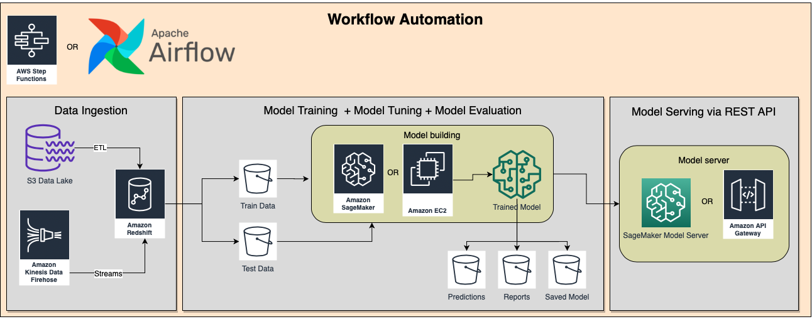

# MLOps Workflow

This repository holds all necessary code and instructions to run an **automated Machine Learning classification worflow** on the [Breast Cancer Winsconsin Diagnostics Dataset](https://www.kaggle.com/uciml/breast-cancer-wisconsin-data).

This dataset represents a series of patient tumor data and their diagnostics (M = malignant, B = benign), and our automated workflow contains the following steps:
- data ingestion
- model training, testing and evaluation
- model persistence (saving on disk)
- model serving via Flask API

## The Workflow
The workflow is divided in three parts:
1. `training/model_building.py`, responsible for data ingestion, model buiding and model persistence.
	- You can check out the Jupyter Notebook for the model building part on this project's `notebook` folder.
2. `api/app.py`, responsible for loading and setting up the API in which the model will be served.
3. `start.sh`, a shell script responsible for setting up the container environment and orchestrating the workflow.

## The API

Click [here](https://app.swaggerhub.com/apis/victorvalentee/MLOpsAPI/0.1.0) for this API's full Swagger documentation. It's a very simple API with a POST endpoint that a client can make requests to.

Request body example:
```json
"mean radius": 1.0,
"mean texture": 2.0,
"mean perimeter": 3.0
```

Response example:
`"Malignant"` or `"Benign"`.

## How to run

1. Clone this repo:

	```$ git clone https://github.com/victorvalentee/mlops_test.git```

2. Run it on Docker!

	On the root folder where the Dockerfile is located, run:

	```
	$ sudo docker image build -t "ml_workflow" .
	$ sudo docker run -it -p 5000:5000 ml_workflow /bin/bash
	```

	These commands will build a docker image and run a docker container that has our ML workflow application, and all the steps described in the previous section will run automatically.

	**After a few seconds, you can already send requests to the API** using curl, swagger, postman or your prefered API testing tool. And you can do this from inside the container or on your localhost.

3. Make requests to the API:

	a. Request example that will return "Malignant":

	```
	$ curl -X POST "http://0.0.0.0:5000/predict" -H "accept: */*" -H "Content-Type: application/json" -d "{\"mean radius\":17.99,\"mean texture\":10.38,\"mean perimeter\":122.8,\"mean area\":1001.0,\"mean smoothness\":0.1184,\"mean compactness\":0.2776,\"mean concavity\":0.3001,\"mean concave points\":0.1471,\"mean symmetry\":0.2419,\"mean fractal dimension\":0.07871,\"radius error\":1.095,\"texture error\":0.9053,\"perimeter error\":8.589,\"area error\":153.4,\"smoothness error\":0.006399,\"compactness error\":0.04904,\"concavity error\":0.05373,\"concave points error\":0.01587,\"symmetry error\":0.03003,\"fractal dimension error\":0.006193,\"worst radius\":25.38,\"worst texture\":17.33,\"worst perimeter\":184.6,\"worst area\":2019.0,\"worst smoothness\":0.1622,\"worst compactness\":0.6656,\"worst concavity\":0.7119,\"worst concave points\":0.2654,\"worst symmetry\":0.4601,\"worst fractal dimension\":0.1189}"
	```

	b. Request example that will return "Benign":
	```
	$ curl -X POST "http://0.0.0.0:5000/predict" -H "accept: */*" -H "Content-Type: application/json" -d "{\"mean radius\":13.54,\"mean texture\":14.36,\"mean perimeter\":87.46,\"mean area\":566.3,\"mean smoothness\":0.09779,\"mean compactness\":0.08129,\"mean concavity\":0.06664,\"mean concave points\":0.04781,\"mean symmetry\":0.1885,\"mean fractal dimension\":0.05766,\"radius error\":0.2699,\"texture error\":0.7886,\"perimeter error\":2.058,\"area error\":23.56,\"smoothness error\":0.008462,\"compactness error\":0.0146,\"concavity error\":0.02387,\"concave points error\":0.01315,\"symmetry error\":0.0198,\"fractal dimension error\":0.0023,\"worst radius\":15.11,\"worst texture\":19.26,\"worst perimeter\":99.7,\"worst area\":711.2,\"worst smoothness\":0.144,\"worst compactness\":0.1773,\"worst concavity\":0.239,\"worst concave points\":0.1288,\"worst symmetry\":0.2977,\"worst fractal dimension\":0.07259}"
	```

## AWS Proposed Infrastructure

As part of this project, I propose an AWS infrastructure that would be able to run this workflow as efficiently and cheap as possible, so I designed a diagram that pretty much sums this up.



## Contact
Victor Valente
- E-mail: victorvalentee@gmail.com
- Tel: (16) 99606-8896
- LinkedIn: https://www.linkedin.com/in/victorvalenteoficial/